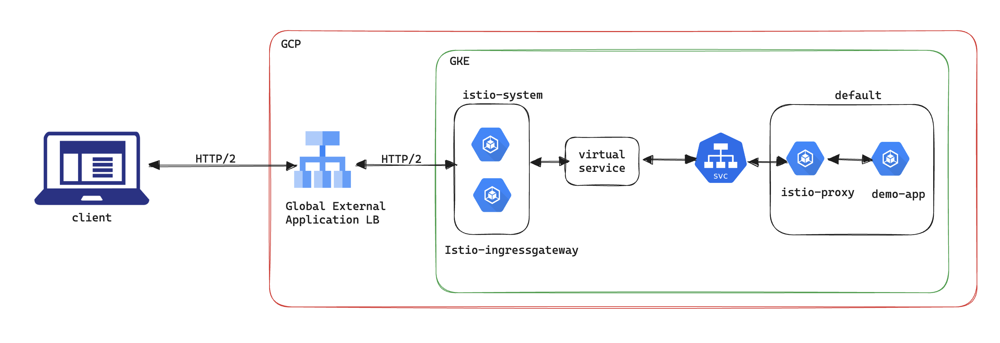

# gke-grpc-gateway-api-with-istio

Steps to deploy gRPC server streaming service running on GKE with istio sidecar and behind Google's Global External Application Load Balancer using the Gateway API, Google-managed
certificate for TLS termination at the LB and self-managed certificate for TLS termination at istio.

## Prerequisites

These steps expect GKE cluster with a Gateway Controller [^1] and internet access (to download the prebuilt container image). Also the usual `gcloud` CLI configured for your project and `kubectl` with credentials to your cluster.

You'll also need working DNS subdomain to point to the load balancer IP.

## Sample setup



## Setup Steps

- Create a static IP for LB.
  ```shell
  $ gcloud compute addresses create grpc-istio-demo-vip \
    --ip-version=IPV4 \
    --global
  ```

- Point the public DNS to the previously created global IP (I'll be
  using `gke-grpc-gateway-api.chimbuc.dns.doit-playground.com`)

- Create Google-managed SSL certificate
  ```shell
  $ gcloud compute ssl-certificates create gke-grpc-gateway-api-cert \
    --domains=gke-grpc-gateway-api.chimbuc.dns.doit-playground.com \
    --global
  ```

- Generate self-signed certificate for the istio ingressgateway

  ```shell
  $ openssl ecparam -genkey -name prime256v1 -noout -out key.pem
  $ openssl req -x509 -new -key key.pem -out cert.pem -days 3650 -subj '/CN=internal'
  ```
  TLS is required both between client and GFE, as well as GFE and backend [^2]. Istio will use the self-signed cert for LB to istio-ingressgateway.

  **Important:** The certificate has to use one of supported signatures
  compatible with BoringSSL, see [^3][^4] for more details. 

- Create K8S Secret with the self-signed cert
  ```shell
  $ kubectl create secret tls grpc-istio-demo-tls \
  --cert=cert.pem \
  --key=key.pem \
  --namespace istio-system
  ```

- Install istio with [istioctl](https://istio.io/latest/docs/setup/install/istioctl/). The `istio-custom.yaml` file contains custom configurations required for this setup.

    The default installation creates a L4 load balancer but we do not require the L4 load balancer for this setup.Go to the Istio release page to download the installation file for your OS, or download and extract the latest release automatically (Linux or macOS):

    ```shell
    $ curl -L https://istio.io/downloadIstio | sh -
    ```

    Move to the Istio package directory. For example, if the package is istio-1.20.0:
    ```shell
    $ cd istio-1.20.0
    ```
    Install Istio with default configuration profile

    ```shell
    $ ./bin/istioctl install -f custom.yaml
    ```

- Enable _istio sidecar injection_ for _default_ namespce.
  ```shell
  $ kubectl label namespace default istio-injection=enabled
  ```

- Deploy the demo app.
  ```shell
  $ kubectl apply -f manifests/01-demo-app.yaml
  ```

  We're using the *Cloud Run gRPC Server Streaming sample application*[^5] which listens on port 8080.

- Deploy the demo app svc.
  ```shell
  $ kubectl apply -f manifests/02-demo-app-service.yaml
  ```

- Deploy _*gke-l7-global-external-managed*_ gateway.
  ```shell
  $ kubectl apply -f manifests/03-gateway.yaml
  ```

- Deploy _istio gateway resource for ingressgateway_
  ```shell
  $ kubectl apply -f manifests/04-istio-default-gateway.yaml
  ```

- Deploy _istio ingressgateway_ HTTPRoute
  ```shell
  $ kubectl apply -f manifests/05-istio-default-httproute.yaml
  ```
  *Don't forget to change the DNS in the manifest.*

- Deploy _istio ingressgateway_ HealthCheckPolicy
  ```shell
  $ kubectl apply -f manifests/06-istio-HealthCheckPolicy.yaml
  ```
  *Istio ingressgateway will be the only backend added to the load balancer and istio will perform internal application routing based on the virtual service configuration*

- Deploy _demo app istio virtual service_
  ```shell
  $ kubectl apply -f manifests/07-demo-app-virtual-service.yaml
  ```

- Optional - Deploy _istio telemetry to enable access logs_
  ```shell
  $ kubectl apply -f manifests/08-istio-telemetry-for-access-logs.yaml
  ```

- Test

  Clone the repository [^5] and build the client:
  ```shell
  $ git clone https://github.com/GoogleCloudPlatform/golang-samples
  $ cd golang-samples/run/grpc-server-streaming
  $ go build -o cli ./client
  ```

  And run the client:
  ```shell
    $ ./cli -server gke-grpc-gateway-api.chimbuc.dns.doit-playground.com:443
    rpc established to timeserver, starting to stream
    received message: current_timestamp: 2023-11-20T13:33:38Z
    received message: current_timestamp: 2023-11-20T13:33:39Z
    received message: current_timestamp: 2023-11-20T13:33:40Z
    received message: current_timestamp: 2023-11-20T13:33:41Z
    received message: current_timestamp: 2023-11-20T13:33:42Z
    received message: current_timestamp: 2023-11-20T13:33:43Z
    received message: current_timestamp: 2023-11-20T13:33:44Z
    received message: current_timestamp: 2023-11-20T13:33:45Z
    received message: current_timestamp: 2023-11-20T13:33:46Z
    received message: current_timestamp: 2023-11-20T13:33:47Z
    end of stream$ 
    ```


[^1]: https://cloud.google.com/kubernetes-engine/docs/concepts/gateway-api
[^2]: https://cloud.google.com/load-balancing/docs/https#using_grpc_with_your_applications
[^3]: https://github.com/grpc/grpc/issues/6722
[^4]: https://groups.google.com/a/chromium.org/forum/#!msg/blink-dev/kWwLfeIQIBM/9chGZ40TCQAJ
[^5]: https://github.com/GoogleCloudPlatform/golang-samples/tree/main/run/grpc-server-streaming
